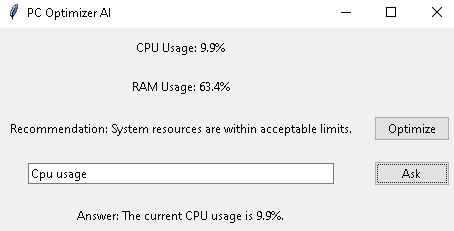

# PCOptimizerAI

## Overview

PCOptimizerAI is an application designed to monitor and optimize system resources such as CPU and RAM usage. It provides real-time recommendations to improve system performance and includes an NLP interface to answer user queries related to system optimization.

## Modules

### [bottleneck.py](#bottleneckpy-context)

This module defines the `BottleNeck` class, which checks for CPU and RAM usage bottlenecks based on predefined thresholds. It provides recommendations when the usage exceeds these thresholds.

### [download_model.py](#download_modelpy-context)

This script downloads and saves the DistilBERT model for question-answering tasks. The model is saved locally in the specified directory.

### [monitor.py](#monitorpy-context)

This module defines the `ResourceMonitor` class, which monitors CPU and RAM usage over a specified duration and interval. It collects and prints resource usage data.

### [nlp_interface.py](#nlp_interfacepy-context)

This module defines the `NLPQuestionAnswering` class, which sets up a question-answering pipeline using the DistilBERT model. It provides a method to get responses to user questions based on the provided context.

### [optimizer.py](#optimizerpy-context)

This module defines the `ResourceOptimizer` class, which optimizes system resources based on current CPU and RAM usage. It provides recommendations and actions to reduce resource usage when thresholds are exceeded.

### [reccomendation.py](#reccomendationpy-context)

This module defines the `Recommendation` class, which provides recommendations based on a cluster label. The cluster label represents different types of usage scenarios such as light work, intensive work, and gaming.

### [test_library.py](#test_librarypy-context)

This script tests the installation of required libraries (`psutil`, `sklearn`, `transformers`) and prints their versions to ensure they are correctly installed.

## Usage

### Running the Application

1. **Download the Model:**
   Run the `download_model.py` script to download and save the DistilBERT model for question-answering tasks.

```bash
python download_model.py
```
   
2. **Start the Application:**
   Run the `PCOptimizerAI.py` script to start the PC Optimizer AI application.

```bash
python PCOptimizerAI.py
```

### Asking Questions

The application includes an NLP interface to answer user queries related to system optimization. Here are some example questions you can ask:

- "How can I improve my system's performance?"
- "Why is my CPU usage high?"
- "How can I free up RAM?"
- "What is the current CPU usage?"
- "What is the current RAM usage?"

## Download and Installation

1. **Clone the Repository:**

```bash
git clone https://github.com/Mike014/PCOptimizerAI.git 
cd PCOptimizerAI
```

2. **Install Dependencies:**

```bash
pip install -r requirements.txt
```

3. **Download the Model:**

```bash
python download_model.py
```

4. **Run the Application:**

```bash
python PCOptimizerAI.py
```

## Screenshot



## Conclusion

PCOptimizerAI is a comprehensive tool for monitoring and optimizing system resources. With its real-time recommendations and NLP interface, users can easily manage their system's performance and get answers to their optimization-related queries.
This project is currently a prototype and will be improved and published soon.
Add `model.safetensor` from [this link](https://drive.google.com/drive/home?hl=it) to the path `modules\models\distilbert-base-cased-distilled-squad`.

 
